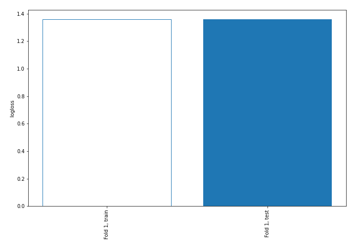
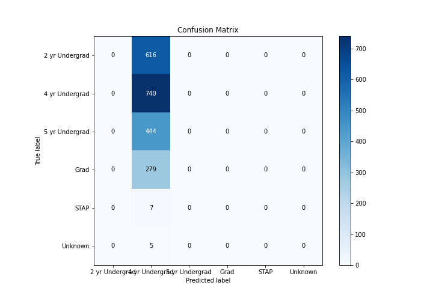
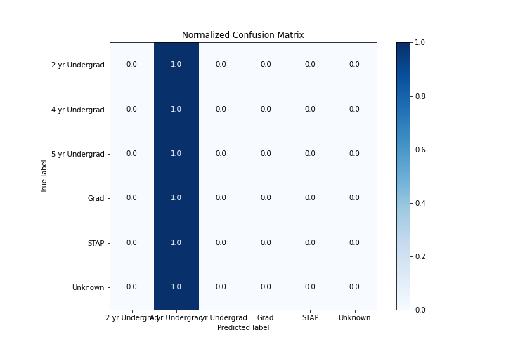
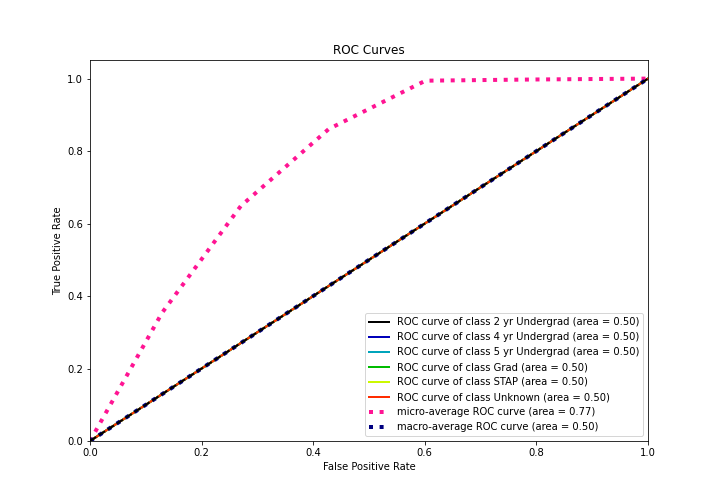
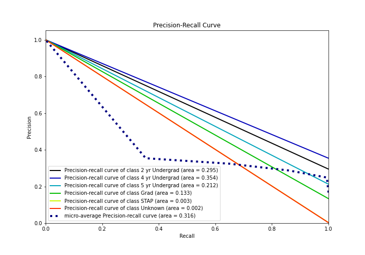

# Summary of 1_Baseline

[<< Go back](../README.md)

## Baseline Classifier (Baseline)
- **n_jobs**: -1
- **num_class**: 6
- **explain_level**: 2

## Validation
 - **validation_type**: split
 - **train_ratio**: 0.75
 - **shuffle**: True
 - **stratify**: True

## Optimized metric
logloss

## Training time

0.6 seconds

### Metric details
|           |   2 yr Undergrad |   4 yr Undergrad |   5 yr Undergrad |   Grad |   STAP |   Unknown |   accuracy |    macro avg |   weighted avg |   logloss |
|:----------|-----------------:|-----------------:|-----------------:|-------:|-------:|----------:|-----------:|-------------:|---------------:|----------:|
| precision |                0 |         0.353898 |                0 |      0 |      0 |         0 |   0.353898 |    0.0589829 |       0.125244 |   1.35895 |
| recall    |                0 |         1        |                0 |      0 |      0 |         0 |   0.353898 |    0.166667  |       0.353898 |   1.35895 |
| f1-score  |                0 |         0.522783 |                0 |      0 |      0 |         0 |   0.353898 |    0.0871306 |       0.185012 |   1.35895 |
| support   |              616 |       740        |              444 |    279 |      7 |         5 |   0.353898 | 2091         |    2091        |   1.35895 |

## Confusion matrix
|                           |   Predicted as 2 yr Undergrad |   Predicted as 4 yr Undergrad |   Predicted as 5 yr Undergrad |   Predicted as Grad |   Predicted as STAP |   Predicted as Unknown |
|:--------------------------|------------------------------:|------------------------------:|------------------------------:|--------------------:|--------------------:|-----------------------:|
| Labeled as 2 yr Undergrad |                             0 |                           616 |                             0 |                   0 |                   0 |                      0 |
| Labeled as 4 yr Undergrad |                             0 |                           740 |                             0 |                   0 |                   0 |                      0 |
| Labeled as 5 yr Undergrad |                             0 |                           444 |                             0 |                   0 |                   0 |                      0 |
| Labeled as Grad           |                             0 |                           279 |                             0 |                   0 |                   0 |                      0 |
| Labeled as STAP           |                             0 |                             7 |                             0 |                   0 |                   0 |                      0 |
| Labeled as Unknown        |                             0 |                             5 |                             0 |                   0 |                   0 |                      0 |

## Learning curves

## Confusion Matrix

## Normalized Confusion Matrix

## ROC Curve

## Precision Recall Curve

[<< Go back](../README.md)
