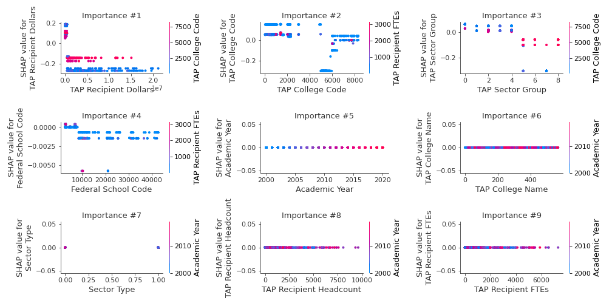

# Summary of 2_DecisionTree

[<< Go back](../README.md)

## Decision Tree
- **n_jobs**: -1
- **criterion**: gini
- **max_depth**: 3
- **num_class**: 6
- **explain_level**: 2

## Validation
 - **validation_type**: split
 - **train_ratio**: 0.75
 - **shuffle**: True
 - **stratify**: True

## Optimized metric
logloss

## Training time

25.4 seconds

### Metric details
|           |   2 yr Undergrad |   4 yr Undergrad |   5 yr Undergrad |       Grad |   STAP |   Unknown |   accuracy |   macro avg |   weighted avg |   logloss |
|:----------|-----------------:|-----------------:|-----------------:|-----------:|-------:|----------:|-----------:|------------:|---------------:|----------:|
| precision |         0.768362 |         0.760243 |         0.57971  |   0.996429 |      0 |         0 |   0.740316 |    0.517457 |       0.751452 |  0.638737 |
| recall    |         0.662338 |         0.677027 |         0.810811 |   1        |      0 |         0 |   0.740316 |    0.525029 |       0.740316 |  0.638737 |
| f1-score  |         0.711421 |         0.716226 |         0.676056 |   0.998211 |      0 |         0 |   0.740316 |    0.516986 |       0.739796 |  0.638737 |
| support   |       616        |       740        |       444        | 279        |      7 |         5 |   0.740316 | 2091        |    2091        |  0.638737 |

## Confusion matrix
|                           |   Predicted as 2 yr Undergrad |   Predicted as 4 yr Undergrad |   Predicted as 5 yr Undergrad |   Predicted as Grad |   Predicted as STAP |   Predicted as Unknown |
|:--------------------------|------------------------------:|------------------------------:|------------------------------:|--------------------:|--------------------:|-----------------------:|
| Labeled as 2 yr Undergrad |                           408 |                            75 |                           133 |                   0 |                   0 |                      0 |
| Labeled as 4 yr Undergrad |                           117 |                           501 |                           121 |                   1 |                   0 |                      0 |
| Labeled as 5 yr Undergrad |                             6 |                            78 |                           360 |                   0 |                   0 |                      0 |
| Labeled as Grad           |                             0 |                             0 |                             0 |                 279 |                   0 |                      0 |
| Labeled as STAP           |                             0 |                             0 |                             7 |                   0 |                   0 |                      0 |
| Labeled as Unknown        |                             0 |                             5 |                             0 |                   0 |                   0 |                      0 |

## Learning curves

## Decision Tree 

### Tree #1

### Rules

if (TAP Recipient Dollars <= 444314.375) and (TAP College Code <= 4987.5) and (TAP Sector Group <= 4.5) then class: 5 yr Undergrad (proba: 59.08%) | based on 1,877 samples

if (TAP Recipient Dollars > 444314.375) and (TAP College Code > 1249.5) and (TAP Sector Group > 0.5) then class: 2 yr Undergrad (proba: 72.19%) | based on 1,255 samples

if (TAP Recipient Dollars > 444314.375) and (TAP College Code <= 1249.5) and (Federal School Code <= 8294.0) then class: 4 yr Undergrad (proba: 98.55%) | based on 1,037 samples

if (TAP Recipient Dollars <= 444314.375) and (TAP College Code > 4987.5) and (TAP College Code <= 5985.0) then class: Grad (proba: 100.0%) | based on 836 samples

if (TAP Recipient Dollars <= 444314.375) and (TAP College Code > 4987.5) and (TAP College Code > 5985.0) then class: 4 yr Undergrad (proba: 47.03%) | based on 708 samples

if (TAP Recipient Dollars <= 444314.375) and (TAP College Code <= 4987.5) and (TAP Sector Group > 4.5) then class: 2 yr Undergrad (proba: 90.17%) | based on 295 samples

if (TAP Recipient Dollars > 444314.375) and (TAP College Code > 1249.5) and (TAP Sector Group <= 0.5) then class: 4 yr Undergrad (proba: 71.27%) | based on 181 samples

if (TAP Recipient Dollars > 444314.375) and (TAP College Code <= 1249.5) and (Federal School Code > 8294.0) then class: 4 yr Undergrad (proba: 64.63%) | based on 82 samples

## Permutation-based Importance

## Confusion Matrix

## Normalized Confusion Matrix

## ROC Curve

## Precision Recall Curve

## SHAP Importance

## SHAP Dependence plots

### Dependence 2 yr Undergrad (Fold 1)

### Dependence 4 yr Undergrad (Fold 1)

### Dependence 5 yr Undergrad (Fold 1)

### Dependence Grad (Fold 1)

### Dependence STAP (Fold 1)

### Dependence Unknown (Fold 1)

## SHAP Decision plots

### Worst decisions for selected sample 1 (Fold 1)

### Worst decisions for selected sample 2 (Fold 1)

### Worst decisions for selected sample 3 (Fold 1)

### Worst decisions for selected sample 4 (Fold 1)

### Best decisions for selected sample 1 (Fold 1)

### Best decisions for selected sample 2 (Fold 1)

### Best decisions for selected sample 3 (Fold 1)

### Best decisions for selected sample 4 (Fold 1)

[<< Go back](../README.md)
