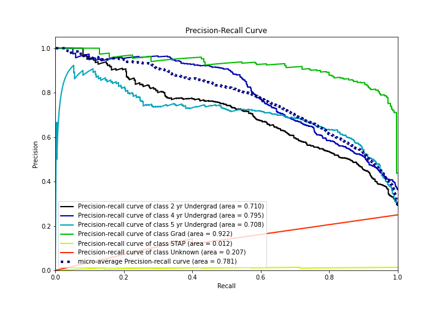

# Summary of 3_Linear

[<< Go back](../README.md)

## Logistic Regression (Linear)
- **n_jobs**: -1
- **num_class**: 6
- **explain_level**: 2

## Validation
 - **validation_type**: split
 - **train_ratio**: 0.75
 - **shuffle**: True
 - **stratify**: True

## Optimized metric
logloss

## Training time

14.5 seconds

### Metric details
|           |   2 yr Undergrad |   4 yr Undergrad |   5 yr Undergrad |       Grad |   STAP |   Unknown |   accuracy |   macro avg |   weighted avg |   logloss |
|:----------|-----------------:|-----------------:|-----------------:|-----------:|-------:|----------:|-----------:|------------:|---------------:|----------:|
| precision |         0.649819 |         0.762821 |         0.639432 |   0.773639 |      0 |         0 |     0.7011 |    0.470952 |       0.700396 |  0.737755 |
| recall    |         0.584416 |         0.643243 |         0.810811 |   0.967742 |      0 |         0 |     0.7011 |    0.501035 |       0.7011   |  0.737755 |
| f1-score  |         0.615385 |         0.697947 |         0.714995 |   0.859873 |      0 |         0 |     0.7011 |    0.481367 |       0.694845 |  0.737755 |
| support   |       616        |       740        |       444        | 279        |      7 |         5 |     0.7011 | 2091        |    2091        |  0.737755 |

## Confusion matrix
|                           |   Predicted as 2 yr Undergrad |   Predicted as 4 yr Undergrad |   Predicted as 5 yr Undergrad |   Predicted as Grad |   Predicted as STAP |   Predicted as Unknown |
|:--------------------------|------------------------------:|------------------------------:|------------------------------:|--------------------:|--------------------:|-----------------------:|
| Labeled as 2 yr Undergrad |                           360 |                           139 |                            98 |                  19 |                   0 |                      0 |
| Labeled as 4 yr Undergrad |                           138 |                           476 |                            91 |                  34 |                   0 |                      1 |
| Labeled as 5 yr Undergrad |                            50 |                             8 |                           360 |                  26 |                   0 |                      0 |
| Labeled as Grad           |                             1 |                             1 |                             7 |                 270 |                   0 |                      0 |
| Labeled as STAP           |                             0 |                             0 |                             7 |                   0 |                   0 |                      0 |
| Labeled as Unknown        |                             5 |                             0 |                             0 |                   0 |                   0 |                      0 |

## Learning curves

## Coefficients

### Coefficients learner #1
|                         |   2 yr Undergrad |   4 yr Undergrad |   5 yr Undergrad |        Grad |      STAP |     Unknown |
|:------------------------|-----------------:|-----------------:|-----------------:|------------:|----------:|------------:|
| intercept               |         6.06943  |        6.27401   |        0.326364  | -2.90855    | -2.346    | -7.41525    |
| Academic Year           |        -0.273755 |        0.15808   |        0.189285  | -1.38461    | -0.857558 |  2.16856    |
| TAP College Code        |        -0.633708 |       -0.628574  |       -0.927317  |  2.42116    | -0.980313 |  0.748751   |
| Federal School Code     |         0.630413 |        0.379101  |        0.0386286 | -0.00863484 | -0.344665 | -0.694843   |
| TAP College Name        |        -0.157055 |       -0.0477283 |       -0.0106782 |  0.433878   | -0.209735 | -0.00868053 |
| Sector Type             |         0.926113 |        0.407807  |        1.13307   | -2.63263    |  0.177392 | -0.0117496  |
| TAP Sector Group        |         1.07061  |        0.623883  |        0.437183  | -4.19718    |  0.215916 |  1.84959    |
| TAP Recipient Headcount |         7.24263  |       -3.42542   |       -3.7786    |  0.72071    | -0.598216 | -0.161104   |
| TAP Recipient FTEs      |        -3.56634  |        7.03864   |       -4.50686   |  1.89698    | -0.675325 | -0.187093   |
| TAP Recipient Dollars   |         3.33042  |        3.84856   |        2.39031   | -8.64638    | -0.623034 | -0.299876   |

## Permutation-based Importance

## Confusion Matrix

## Normalized Confusion Matrix

## ROC Curve

## Precision Recall Curve

## SHAP Importance

## SHAP Dependence plots

### Dependence 2 yr Undergrad (Fold 1)

### Dependence 4 yr Undergrad (Fold 1)

### Dependence 5 yr Undergrad (Fold 1)

### Dependence Grad (Fold 1)

### Dependence STAP (Fold 1)

### Dependence Unknown (Fold 1)

## SHAP Decision plots

### Worst decisions for selected sample 1 (Fold 1)

### Worst decisions for selected sample 2 (Fold 1)

### Worst decisions for selected sample 3 (Fold 1)

### Worst decisions for selected sample 4 (Fold 1)

### Best decisions for selected sample 1 (Fold 1)

### Best decisions for selected sample 2 (Fold 1)

### Best decisions for selected sample 3 (Fold 1)

### Best decisions for selected sample 4 (Fold 1)

[<< Go back](../README.md)
