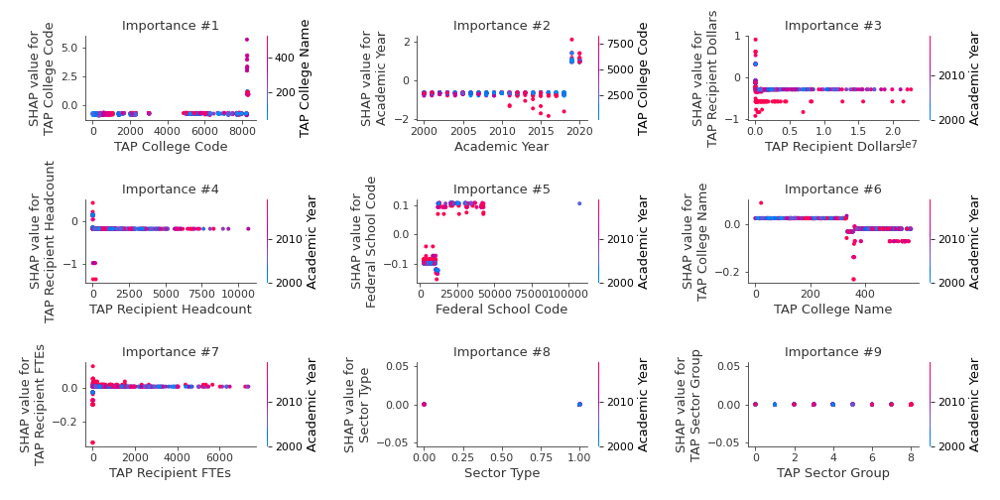
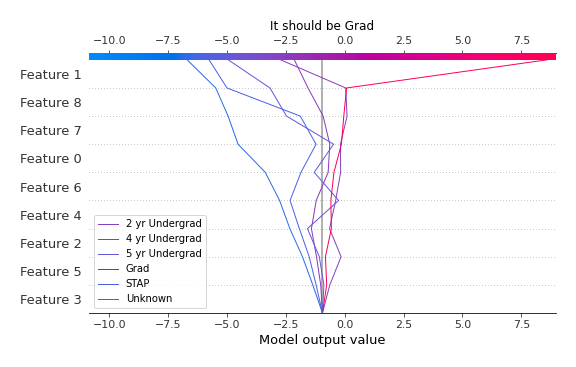
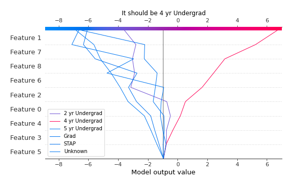

# Summary of 4_Default_Xgboost

[<< Go back](../README.md)

## Extreme Gradient Boosting (Xgboost)
- **n_jobs**: -1
- **objective**: multi:softprob
- **eta**: 0.075
- **max_depth**: 6
- **min_child_weight**: 1
- **subsample**: 1.0
- **colsample_bytree**: 1.0
- **eval_metric**: mlogloss
- **num_class**: 6
- **explain_level**: 2

## Validation
 - **validation_type**: split
 - **train_ratio**: 0.75
 - **shuffle**: True
 - **stratify**: True

## Optimized metric
logloss

## Training time

39.6 seconds

### Metric details
|           |   2 yr Undergrad |   4 yr Undergrad |   5 yr Undergrad |       Grad |     STAP |   Unknown |   accuracy |   macro avg |   weighted avg |   logloss |
|:----------|-----------------:|-----------------:|-----------------:|-----------:|---------:|----------:|-----------:|------------:|---------------:|----------:|
| precision |         0.946429 |         0.959722 |         0.880342 |   0.996429 | 1        |  0.833333 |   0.942611 |    0.936042 |       0.943681 |  0.175651 |
| recall    |         0.946429 |         0.933784 |         0.927928 |   1        | 0.142857 |  1        |   0.942611 |    0.825166 |       0.942611 |  0.175651 |
| f1-score  |         0.946429 |         0.946575 |         0.903509 |   0.998211 | 0.25     |  0.909091 |   0.942611 |    0.825636 |       0.941856 |  0.175651 |
| support   |       616        |       740        |       444        | 279        | 7        |  5        |   0.942611 | 2091        |    2091        |  0.175651 |

## Confusion matrix
|                           |   Predicted as 2 yr Undergrad |   Predicted as 4 yr Undergrad |   Predicted as 5 yr Undergrad |   Predicted as Grad |   Predicted as STAP |   Predicted as Unknown |
|:--------------------------|------------------------------:|------------------------------:|------------------------------:|--------------------:|--------------------:|-----------------------:|
| Labeled as 2 yr Undergrad |                           583 |                             8 |                            25 |                   0 |                   0 |                      0 |
| Labeled as 4 yr Undergrad |                            16 |                           691 |                            31 |                   1 |                   0 |                      1 |
| Labeled as 5 yr Undergrad |                            15 |                            17 |                           412 |                   0 |                   0 |                      0 |
| Labeled as Grad           |                             0 |                             0 |                             0 |                 279 |                   0 |                      0 |
| Labeled as STAP           |                             2 |                             4 |                             0 |                   0 |                   1 |                      0 |
| Labeled as Unknown        |                             0 |                             0 |                             0 |                   0 |                   0 |                      5 |

## Learning curves

## Permutation-based Importance

## Confusion Matrix

## Normalized Confusion Matrix

## ROC Curve

## Precision Recall Curve

## SHAP Importance

## SHAP Dependence plots

### Dependence 2 yr Undergrad (Fold 1)

### Dependence 4 yr Undergrad (Fold 1)

### Dependence 5 yr Undergrad (Fold 1)

### Dependence Grad (Fold 1)

### Dependence STAP (Fold 1)

### Dependence Unknown (Fold 1)

## SHAP Decision plots

### Worst decisions for selected sample 1 (Fold 1)

### Worst decisions for selected sample 2 (Fold 1)

### Worst decisions for selected sample 3 (Fold 1)

### Worst decisions for selected sample 4 (Fold 1)

### Best decisions for selected sample 1 (Fold 1)

### Best decisions for selected sample 2 (Fold 1)

### Best decisions for selected sample 3 (Fold 1)

### Best decisions for selected sample 4 (Fold 1)

[<< Go back](../README.md)
