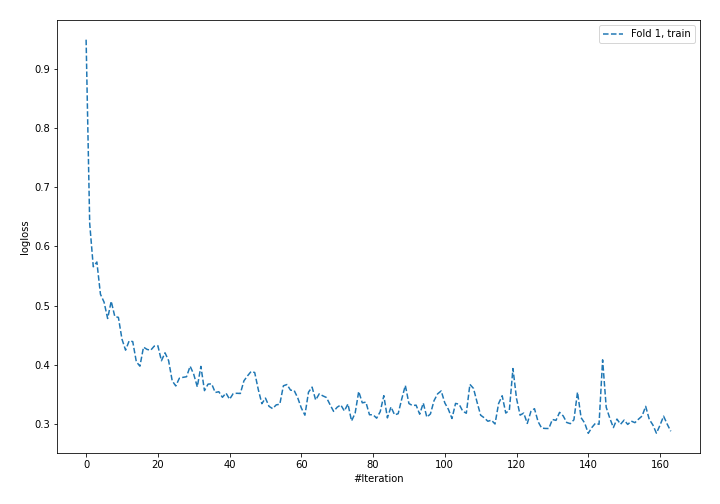
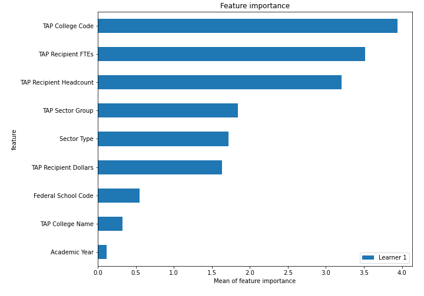
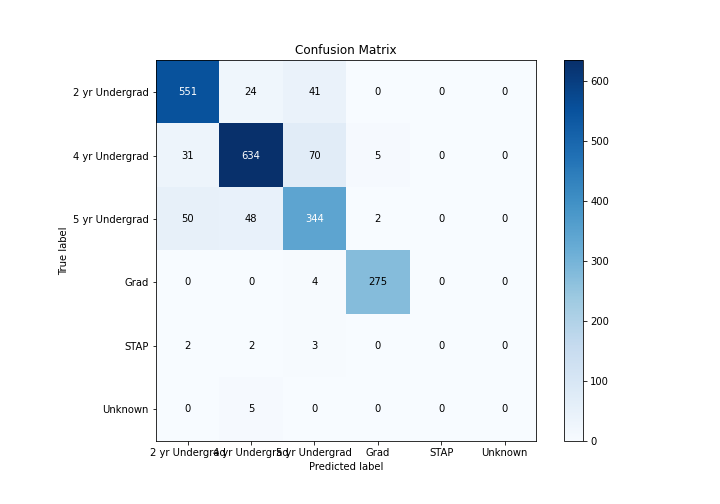
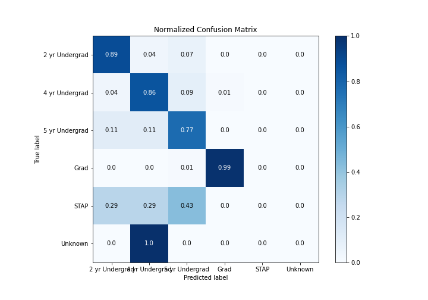
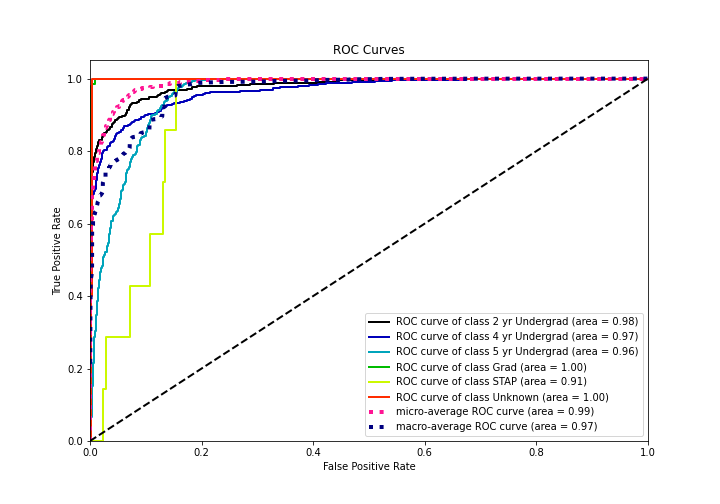
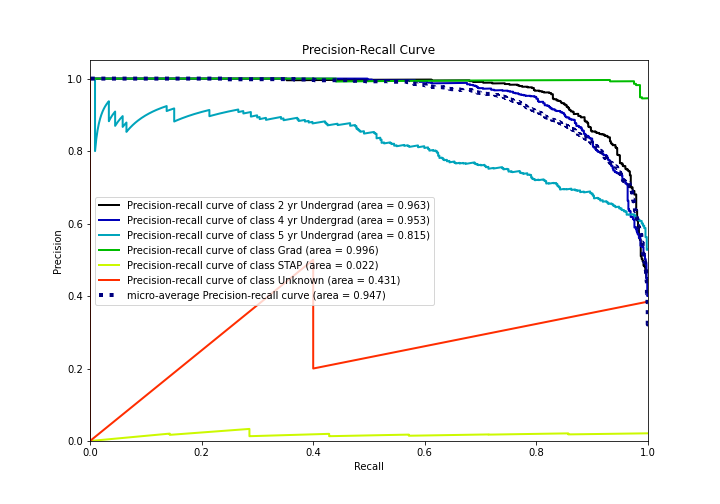

# Summary of 5_Default_NeuralNetwork

[<< Go back](../README.md)

## Neural Network
- **n_jobs**: -1
- **dense_1_size**: 32
- **dense_2_size**: 16
- **learning_rate**: 0.05
- **num_class**: 6
- **explain_level**: 2

## Validation
 - **validation_type**: split
 - **train_ratio**: 0.75
 - **shuffle**: True
 - **stratify**: True

## Optimized metric
logloss

## Training time

8.1 seconds

### Metric details
|           |   2 yr Undergrad |   4 yr Undergrad |   5 yr Undergrad |       Grad |   STAP |   Unknown |   accuracy |   macro avg |   weighted avg |   logloss |
|:----------|-----------------:|-----------------:|-----------------:|-----------:|-------:|----------:|-----------:|------------:|---------------:|----------:|
| precision |         0.869085 |         0.889201 |         0.744589 |   0.975177 |      0 |         0 |   0.862745 |    0.579675 |       0.858937 |  0.364518 |
| recall    |         0.894481 |         0.856757 |         0.774775 |   0.985663 |      0 |         0 |   0.862745 |    0.585279 |       0.862745 |  0.364518 |
| f1-score  |         0.8816   |         0.872677 |         0.759382 |   0.980392 |      0 |         0 |   0.862745 |    0.582342 |       0.860613 |  0.364518 |
| support   |       616        |       740        |       444        | 279        |      7 |         5 |   0.862745 | 2091        |    2091        |  0.364518 |

## Confusion matrix
|                           |   Predicted as 2 yr Undergrad |   Predicted as 4 yr Undergrad |   Predicted as 5 yr Undergrad |   Predicted as Grad |   Predicted as STAP |   Predicted as Unknown |
|:--------------------------|------------------------------:|------------------------------:|------------------------------:|--------------------:|--------------------:|-----------------------:|
| Labeled as 2 yr Undergrad |                           551 |                            24 |                            41 |                   0 |                   0 |                      0 |
| Labeled as 4 yr Undergrad |                            31 |                           634 |                            70 |                   5 |                   0 |                      0 |
| Labeled as 5 yr Undergrad |                            50 |                            48 |                           344 |                   2 |                   0 |                      0 |
| Labeled as Grad           |                             0 |                             0 |                             4 |                 275 |                   0 |                      0 |
| Labeled as STAP           |                             2 |                             2 |                             3 |                   0 |                   0 |                      0 |
| Labeled as Unknown        |                             0 |                             5 |                             0 |                   0 |                   0 |                      0 |

## Learning curves

## Permutation-based Importance

## Confusion Matrix

## Normalized Confusion Matrix

## ROC Curve

## Precision Recall Curve

[<< Go back](../README.md)
