# Summary of 6_Default_RandomForest

[<< Go back](../README.md)

## Random Forest
- **n_jobs**: -1
- **criterion**: gini
- **max_features**: 0.9
- **min_samples_split**: 30
- **max_depth**: 4
- **eval_metric_name**: logloss
- **num_class**: 6
- **explain_level**: 2

## Validation
 - **validation_type**: split
 - **train_ratio**: 0.75
 - **shuffle**: True
 - **stratify**: True

## Optimized metric
logloss

## Training time

17.5 seconds

### Metric details
|           |   2 yr Undergrad |   4 yr Undergrad |   5 yr Undergrad |       Grad |   STAP |   Unknown |   accuracy |   macro avg |   weighted avg |   logloss |
|:----------|-----------------:|-----------------:|-----------------:|-----------:|-------:|----------:|-----------:|------------:|---------------:|----------:|
| precision |         0.754829 |         0.870036 |         0.652397 |   0.996429 |      0 |         0 |   0.789096 |    0.545615 |       0.801755 |  0.527478 |
| recall    |         0.824675 |         0.651351 |         0.858108 |   1        |      0 |         0 |   0.789096 |    0.555689 |       0.789096 |  0.527478 |
| f1-score  |         0.788208 |         0.744977 |         0.741245 |   0.998211 |      0 |         0 |   0.789096 |    0.54544  |       0.786434 |  0.527478 |
| support   |       616        |       740        |       444        | 279        |      7 |         5 |   0.789096 | 2091        |    2091        |  0.527478 |

## Confusion matrix
|                           |   Predicted as 2 yr Undergrad |   Predicted as 4 yr Undergrad |   Predicted as 5 yr Undergrad |   Predicted as Grad |   Predicted as STAP |   Predicted as Unknown |
|:--------------------------|------------------------------:|------------------------------:|------------------------------:|--------------------:|--------------------:|-----------------------:|
| Labeled as 2 yr Undergrad |                           508 |                            19 |                            89 |                   0 |                   0 |                      0 |
| Labeled as 4 yr Undergrad |                           150 |                           482 |                           107 |                   1 |                   0 |                      0 |
| Labeled as 5 yr Undergrad |                            15 |                            48 |                           381 |                   0 |                   0 |                      0 |
| Labeled as Grad           |                             0 |                             0 |                             0 |                 279 |                   0 |                      0 |
| Labeled as STAP           |                             0 |                             0 |                             7 |                   0 |                   0 |                      0 |
| Labeled as Unknown        |                             0 |                             5 |                             0 |                   0 |                   0 |                      0 |

## Learning curves
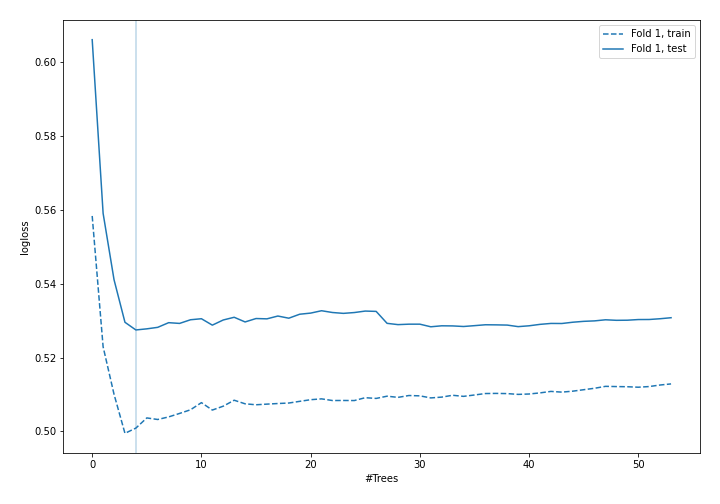

## Permutation-based Importance
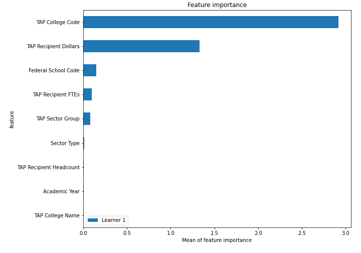
## Confusion Matrix

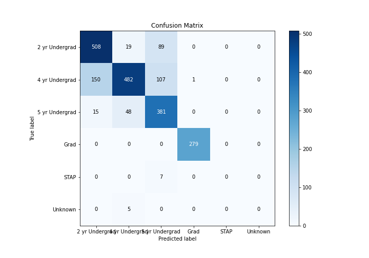

## Normalized Confusion Matrix

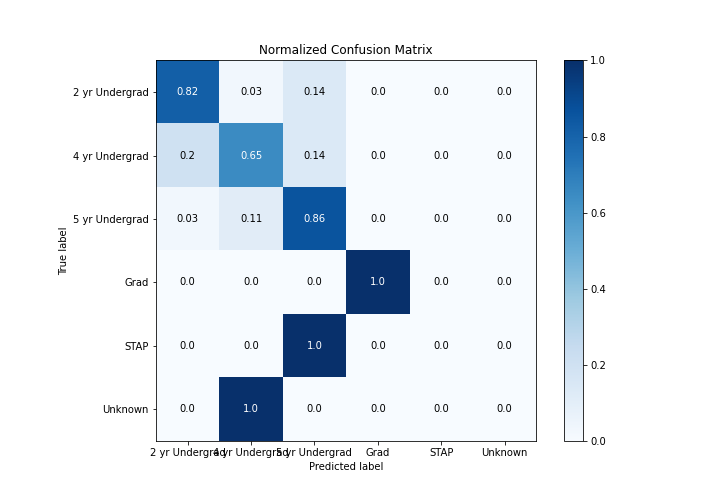

## ROC Curve

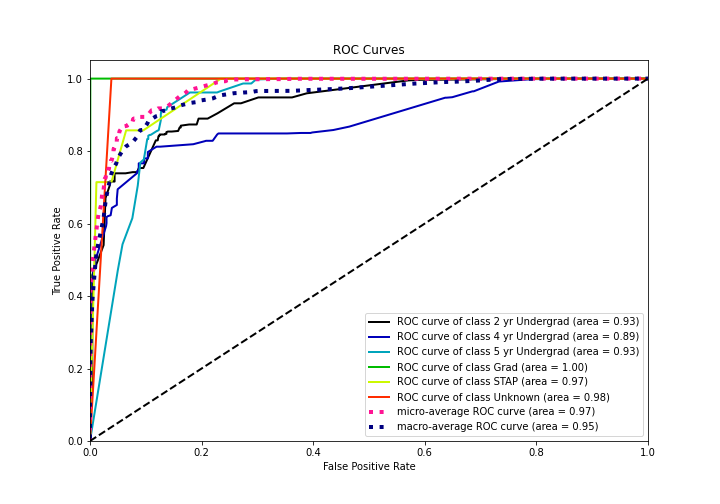

## Precision Recall Curve

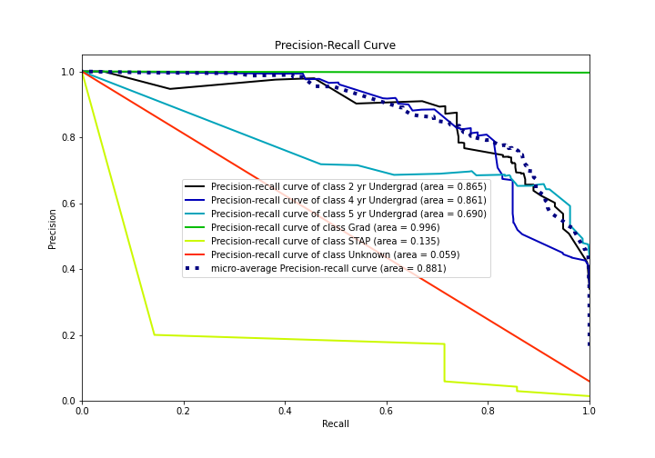

## SHAP Importance
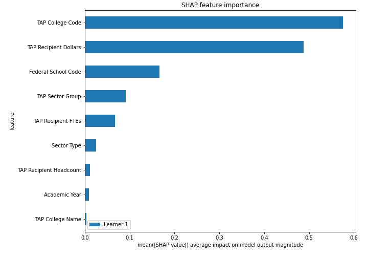

## SHAP Dependence plots

### Dependence 2 yr Undergrad (Fold 1)
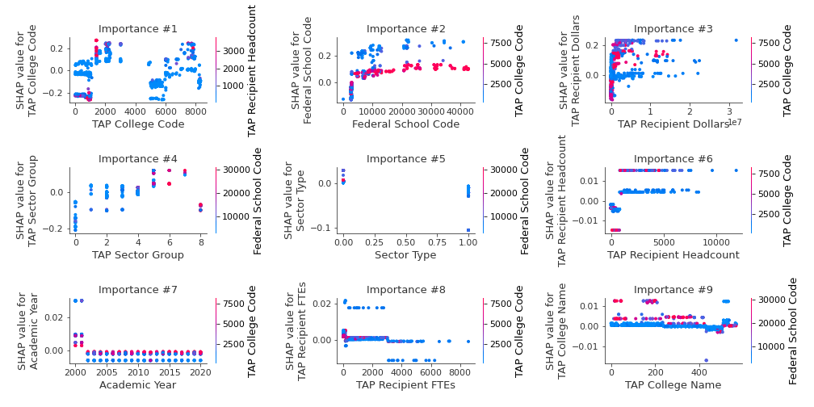
### Dependence 4 yr Undergrad (Fold 1)
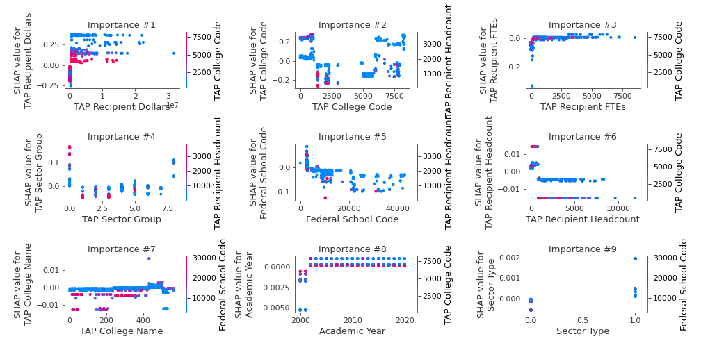
### Dependence 5 yr Undergrad (Fold 1)
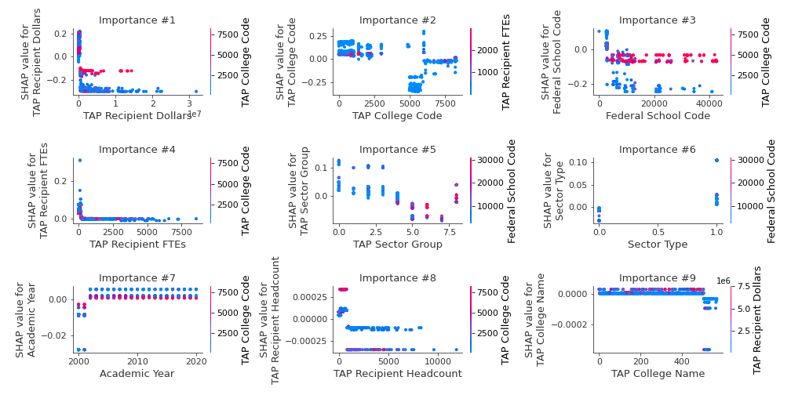
### Dependence Grad (Fold 1)
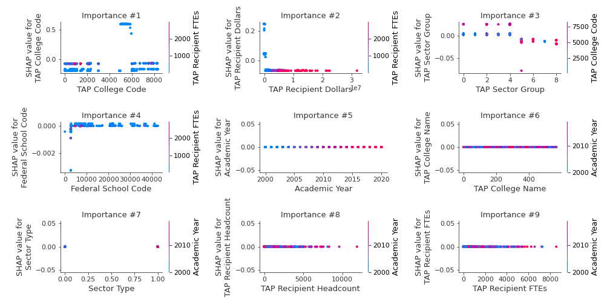
### Dependence STAP (Fold 1)
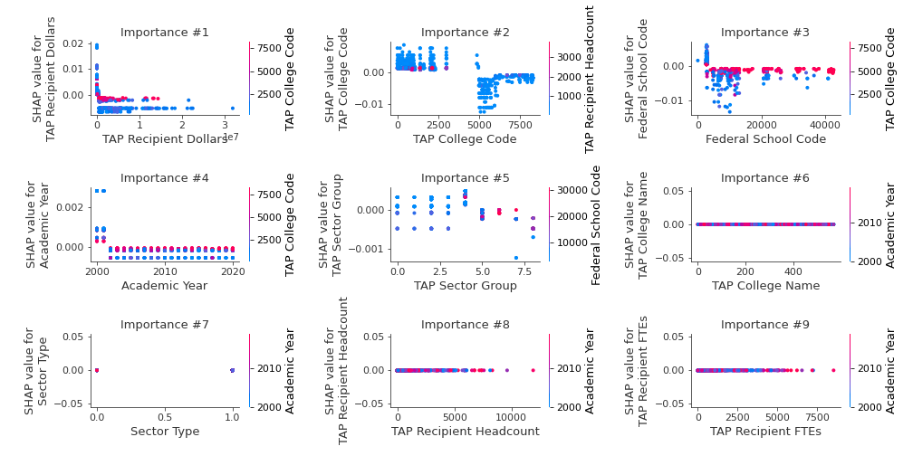
### Dependence Unknown (Fold 1)
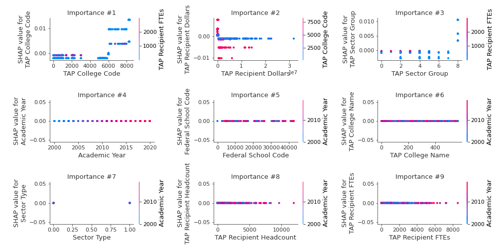

## SHAP Decision plots

### Worst decisions for selected sample 1 (Fold 1)

### Worst decisions for selected sample 2 (Fold 1)
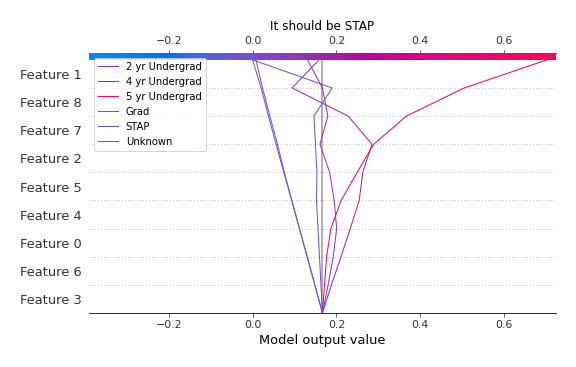
### Worst decisions for selected sample 3 (Fold 1)
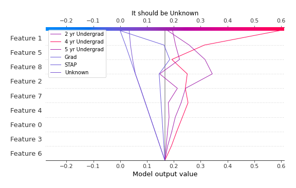
### Worst decisions for selected sample 4 (Fold 1)

### Best decisions for selected sample 1 (Fold 1)
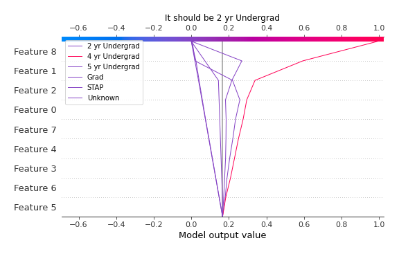
### Best decisions for selected sample 2 (Fold 1)
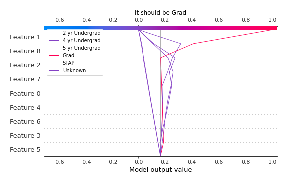
### Best decisions for selected sample 3 (Fold 1)

### Best decisions for selected sample 4 (Fold 1)
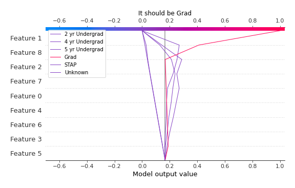

[<< Go back](../README.md)
