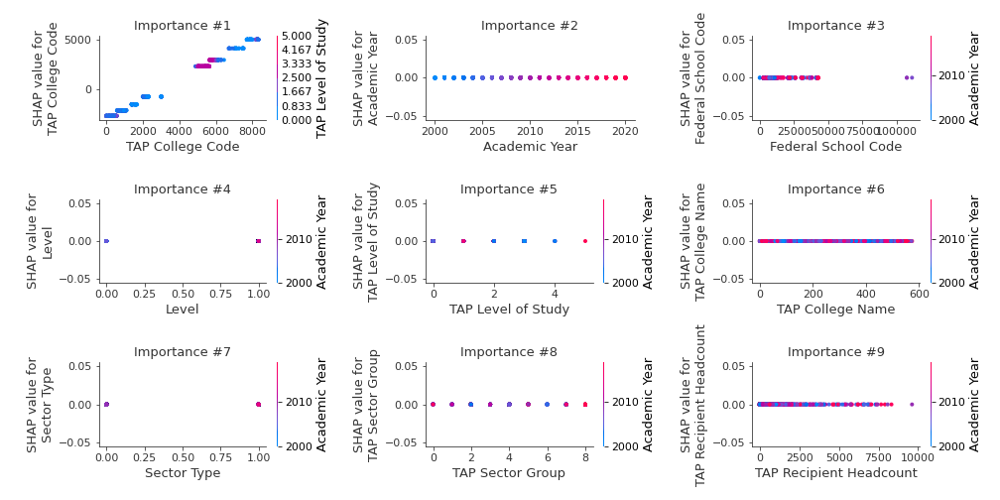

# Summary of 2_DecisionTree

[<< Go back](../README.md)

## Decision Tree
- **n_jobs**: -1
- **criterion**: mse
- **max_depth**: 3
- **explain_level**: 2

## Validation
 - **validation_type**: split
 - **train_ratio**: 0.75
 - **shuffle**: True

## Optimized metric
rmse

## Training time

12.9 seconds

### Metric details:
| Metric   |        Score |
|:---------|-------------:|
| MAE      |   156.83     |
| MSE      | 39864.4      |
| RMSE     |   199.661    |
| R2       |     0.994773 |
| MAPE     |     0.445307 |

## Learning curves

## Decision Tree 

### Tree #1

### Rules

if (TAP College Code <= 3958.0) and (TAP College Code <= 1249.5) and (TAP College Code > 577.5) then response: 857.281 | based on 1,794 samples

if (TAP College Code <= 3958.0) and (TAP College Code > 1249.5) and (TAP College Code > 1845.0) then response: 2257.646 | based on 1,467 samples

if (TAP College Code <= 3958.0) and (TAP College Code <= 1249.5) and (TAP College Code <= 577.5) then response: 299.801 | based on 1,447 samples

if (TAP College Code > 3958.0) and (TAP College Code > 6589.0) and (TAP College Code > 7604.5) then response: 8036.34 | based on 949 samples

if (TAP College Code > 3958.0) and (TAP College Code <= 6589.0) and (TAP College Code <= 5650.0) then response: 5323.347 | based on 929 samples

if (TAP College Code <= 3958.0) and (TAP College Code > 1249.5) and (TAP College Code <= 1845.0) then response: 1458.117 | based on 803 samples

if (TAP College Code > 3958.0) and (TAP College Code <= 6589.0) and (TAP College Code > 5650.0) then response: 5970.049 | based on 595 samples

if (TAP College Code > 3958.0) and (TAP College Code > 6589.0) and (TAP College Code <= 7604.5) then response: 7145.786 | based on 360 samples

## Permutation-based Importance

## True vs Predicted

## Predicted vs Residuals

## SHAP Importance

## SHAP Dependence plots

### Dependence (Fold 1)

## SHAP Decision plots

### Top-10 Worst decisions (Fold 1)

### Top-10 Best decisions (Fold 1)

[<< Go back](../README.md)
