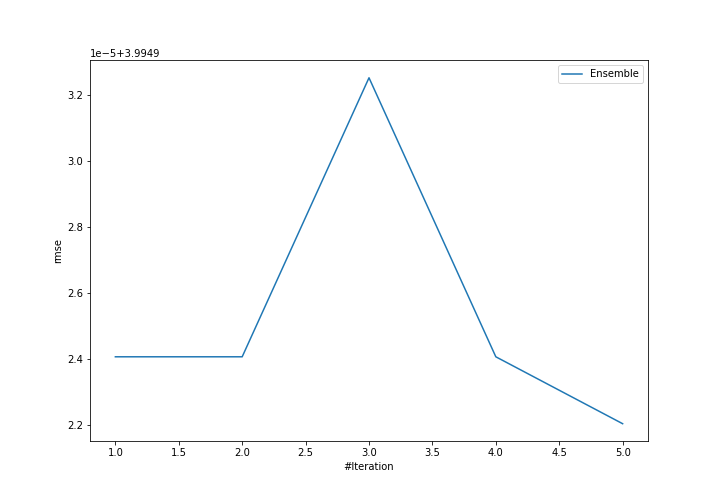
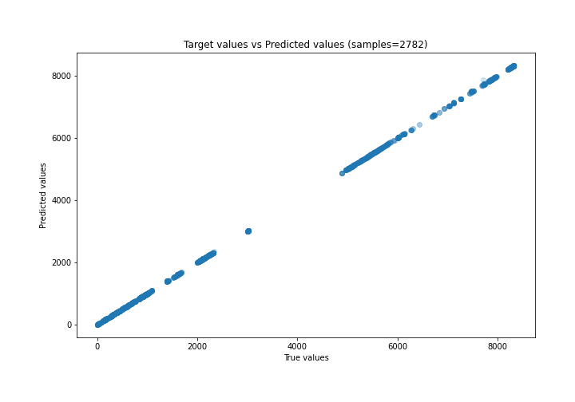
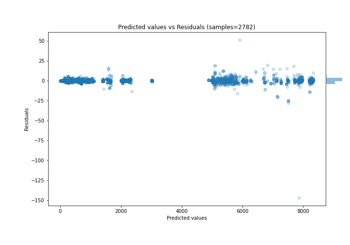

# Summary of Ensemble

[<< Go back](../README.md)

## Ensemble structure
| Model             |   Weight |
|:------------------|---------:|
| 3_Default_Xgboost |        5 |

### Metric details:
| Metric   |       Score |
|:---------|------------:|
| MAE      |  1.49057    |
| MSE      | 15.9594     |
| RMSE     |  3.99492    |
| R2       |  0.999998   |
| MAPE     |  0.00149073 |

## Learning curves

## True vs Predicted

## Predicted vs Residuals

[<< Go back](../README.md)
